# Istanbul Technical University LaTeX Templates

The purpose of these templates is to provide Istanbul Technical University (ITU) students, from their freshman year to their senior year, with LaTeX resources for preparing their academic documents. These templates ensure that students create more aesthetically pleasing documents while also benefiting from the powerful formatting and collaboration capabilities that LaTeX offers.


Using LaTeX promotes consistency, professionalism, and ease of use across various types of documents. It not only helps students present their work in a visually appealing manner but also makes writing assignments, reports, and theses more collaborative and structured. 


All the photos of ITU Campuses used in the templates are sourced from Istanbul Technical University's official Twitter account. According to the ITU Twitter account, the photographers credited for these pictures are ITU Social Media Staff, Ahmet Sadi Öcal, Begüm Karataş, and Siraç Uzuntok.


## Bachelor Thesis

The goal of this template is to enhance and refine the (Xe)LaTeX template for students who desire a well-designed and aesthetically pleasing thesis format from Istanbul Technical University. By integrating key features from both Zwaneveld's and Nielsen's templates, this version simplifies the formatting process and offers additional improvements to streamline the work for thesis writers. Also, this template is created for senior students at Istanbul Technical University to easily incorporate both mathematical expressions and maintain a modular structured system in their theses. The template is designed to assist students in preparing their thesis with a focus on clarity, organization, and ease of use. ITU students using this template will need to update the `main.tex` file for the core structure of their thesis, as well as fill in the `mainmatter` folder for the main content and the `backmatter/appendices` folder for any appendices. The additional files provided are intended to support the creation of the template structure.

For those interested in customizing the cover of their thesis, further instructions can be found in the `itutextemplates/bachelor_thesis/README.md` file.

This template combines elements from two existing projects:

*	Daan Zwaneveld's work, which can be found here](https://dzwaneveld.github.io) and is licensed under [CC BY-NC 4.0](https://creativecommons.org/licenses/by-nc/4.0/).
*	Christian Nicolai Nielsen's DTU Thesis template, which is available at [DTU Design Guide](https://www.designguide.dtu.dk).

The goal of this template is to enhance and refine the (Xe)LaTeX template for students who desire a well-designed and aesthetically pleasing thesis format from Istanbul Technical University. By integrating key features from both Zwaneveld's and Nielsen's templates, this version simplifies the formatting process and offers additional improvements to streamline the work for thesis writers.


| Cover       |  Back Cover |
:----------------:|:---------------------:
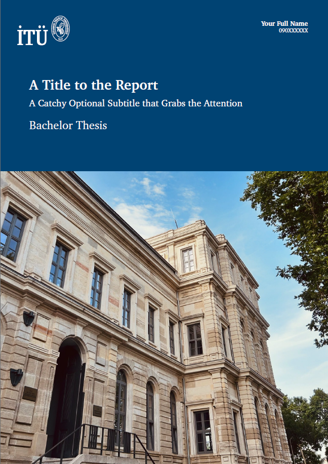 | 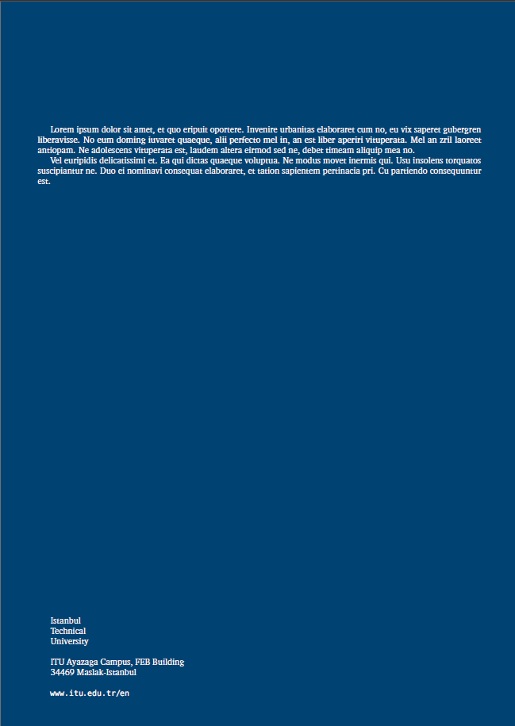

|   Prelude  |  Chapter 1 |  Appendix - A |
:----------------:|----------------:|:---------------------:
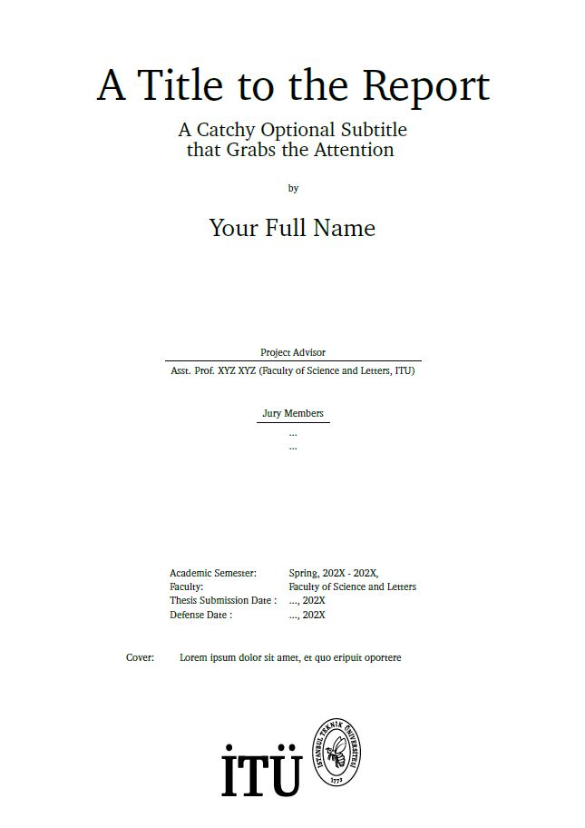 | 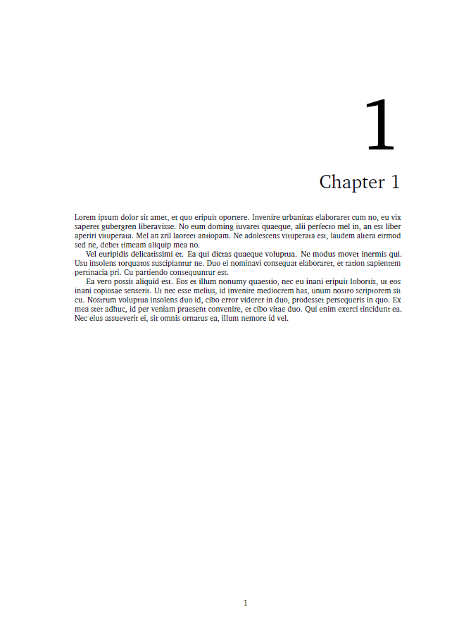 | 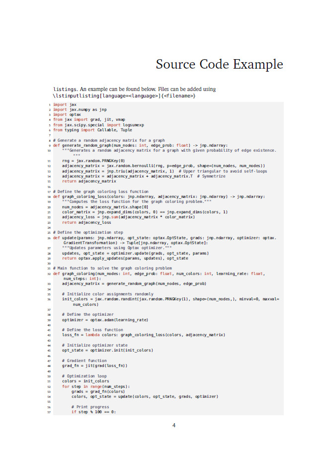

## Letter

I created this LaTeX template for ITU students who need to send formal emails or letters to official institutions. Additionally, ITU clubs can use this template when applying for event approvals. The `ituletter` LaTeX class is derived from Nesime Tatbul's `brownletter` class (2003, tatbul@cs.brown.edu), which was originally designed for Brown University. I extend my thanks to Nesime Tatbul for developing this class.


This template is designed to ensure that correspondence from ITU students, faculty, and staff upholds a high standard of professionalism and clarity. The `ituletter` class, built on LaTeX's standard letter class, introduces specific formatting tailored to ITU's aesthetic needs. Key features include custom margins, header and footer settings, and the integration of ITU’s logo. The template also provides commands for easily adding a subject line and formatting the opening and closing sections of the letter.


The layout is automatically adjusted to fit letter paper size, with predefined text width, height, and header/footer placement, making it ideal for official communication. By using this class, ITU students, faculty, and staff can create consistent, polished letters for any formal purpose.


To use the template, simply modify the `main.tex` file directly.


|  Letter     |
:----------------:
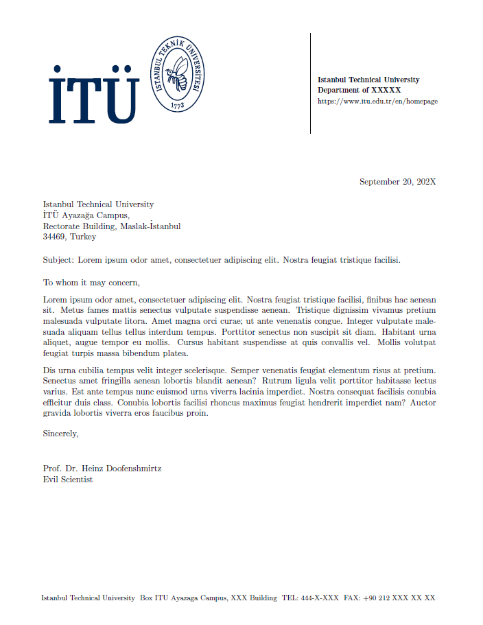

## Lab Report

I created this LaTeX template to help ITU students structure their lab reports more effectively. Although the template is primarily designed for pre-reports, students can easily add new pages to extend it and create longer post-lab reports. This flexibility makes it suitable for various stages of lab report writing.

This template includes sections such as:

* Theory
* Aim of the Experiment
* Performing the Experiment
* Results of the Experiment


To use the template, simply modify the `main.tex` file directly to fit your needs.


|  Lab Report     |
:----------------:
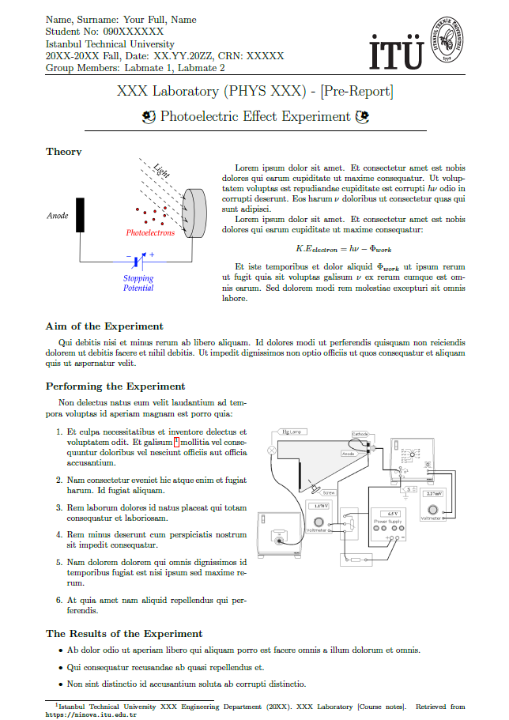

## Presentation

This LaTeX template is specifically designed for creating Beamer presentations at Istanbul Technical University. It provides a basic structure that is easy to customize, with sections for title, contents, introduction, conclusion, and acknowledgments, allowing students to prepare professional and well-organized presentations.

This template was created using the Beamer's Warsaw template, with the only modification being the addition of the ITU logo to align it with ITU’s branding.

To use the template, simply modify the `main.tex` file directly.

|  Cover     |
:----------------:
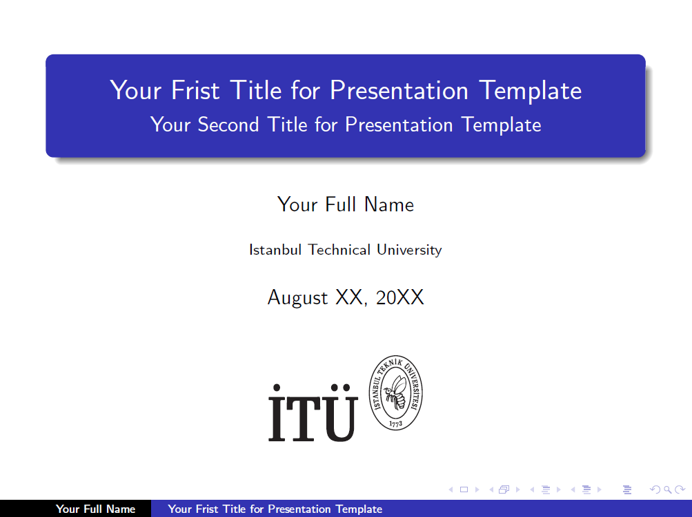

## Homework

This LaTeX template is designed to help ITU students organize their homework submissions in a professional and structured manner. It provides an easy-to-read layout for mathematical computations, problem-solving, and various scientific notations, making it ideal for technical assignments.

The template includes sections dedicated to each problem and its solution, as well as a title page for clear and concise presentation.

To use the template, simply modify the `main.tex` file directly.


| Cover       |  Inside |
:----------------:|:---------------------:
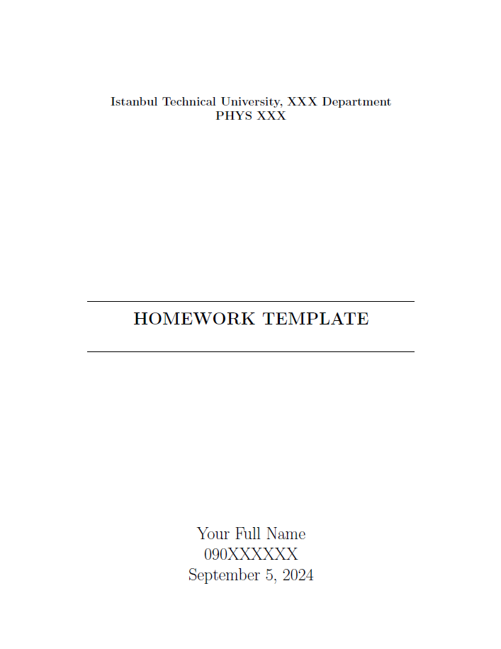 | 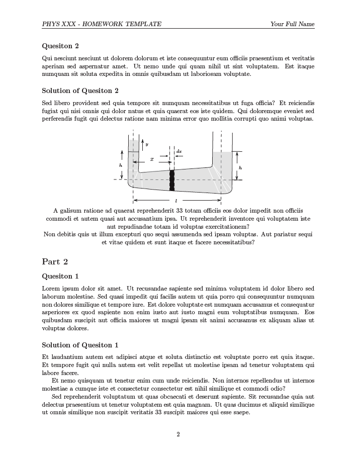


## Internship Report

This document is an internship report template for Istanbul Technical University (ITU), designed to follow the official formatting guidelines for internship reports. It includes sections for student and institution information, a detailed table of contents, and placeholders for the report content. The structure is highly customizable to accommodate various fields of study.

To use the template, simply modify the `main.tex` file directly.

|   Cover  |  Table of Contents |  Appendix - A |
:----------------:|----------------:|:---------------------:
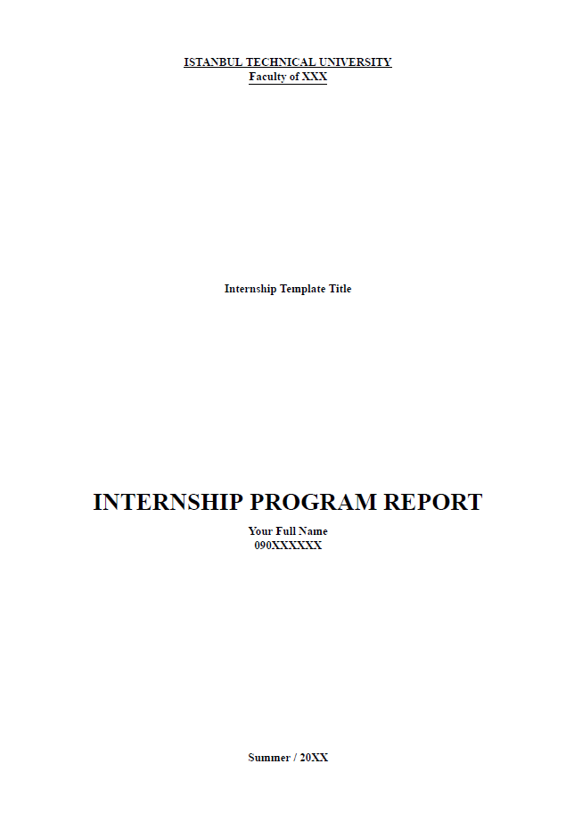 | 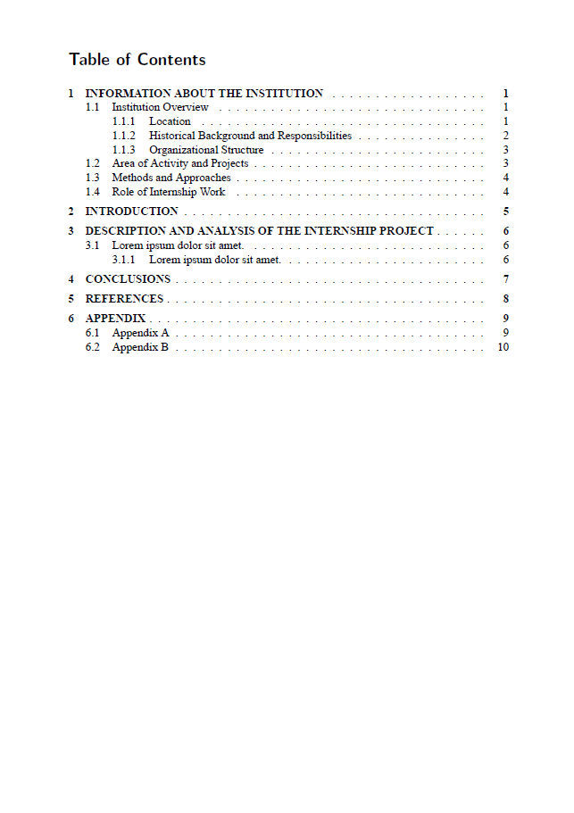 | 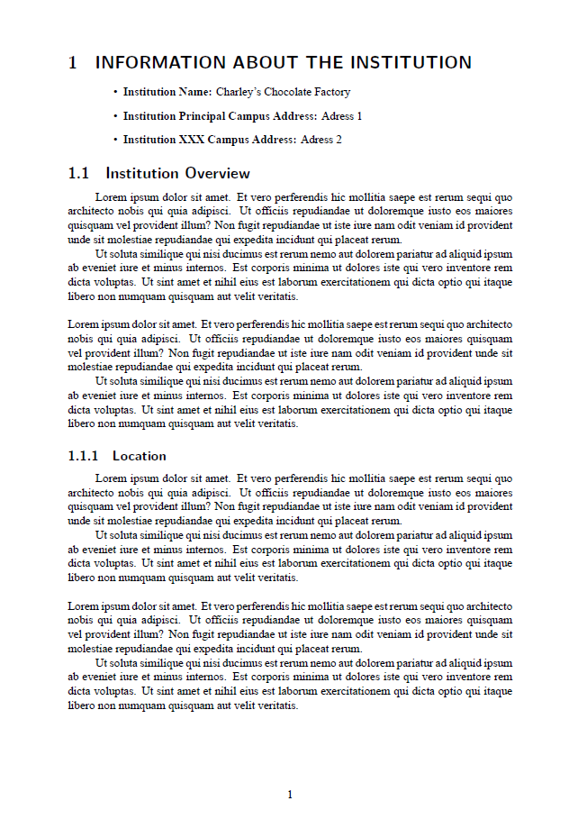

## How to Cite This Repository

If you use or reference any of the templates provided in this repository, please cite it as follows:


```bibtex
@misc{itutextemplates, author = {Bahrem Serhat Daniş}, title = {Istanbul Technical University LaTeX Templates}, year = {2024}, url = {https://github.com/bahremsd/itutextemplates}, note = {This repository contains LaTeX templates for Istanbul Technical University, including theses, assignments, emails, and slides.} }
```