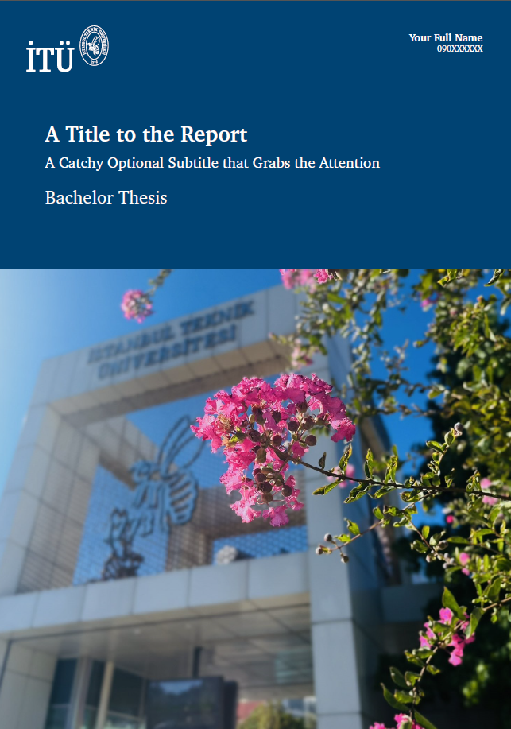
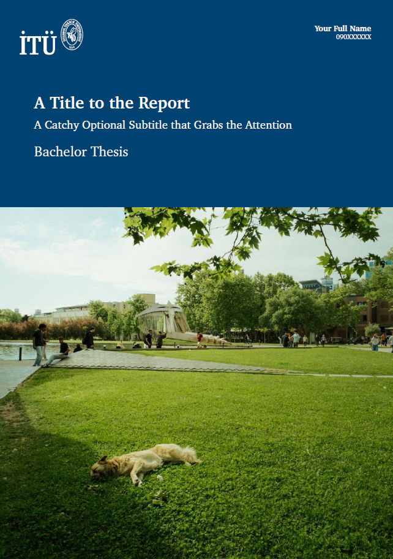

# How to Change the Cover Photo of the Thesis?

Changing the cover photo in this template is a simple process. Follow these steps:

## Steps to Change the Cover Photo:

1. **Add your photo**  
   Place the image you want to use as your cover photo in the `structure/structure_figures` directory.  
   **Note:** The ideal photo ratio is **16:13** for the best results.

2. **Modify the .cls file**  
   Open the `itu-thesis.cls` file in a text editor and locate **line 197**.

3. **Update the file path**  
   Replace the default image path `itu_thesis_cover_photo.jpg` with the path to your newly added photo. Your code should look like this:
   
	```bash
	{\includegraphics[height=18.9cm, keepaspectratio]{structure/structure_figures/your_new_photo.jpg}};
	```
|                 |                      |
:----------------:|:---------------------:
 | 

|                 |                      |
:----------------:|:---------------------:
 | 

|                 |                      |
:----------------:|:---------------------:
 | 

|                 |                      |
:----------------:|:---------------------:
 | 